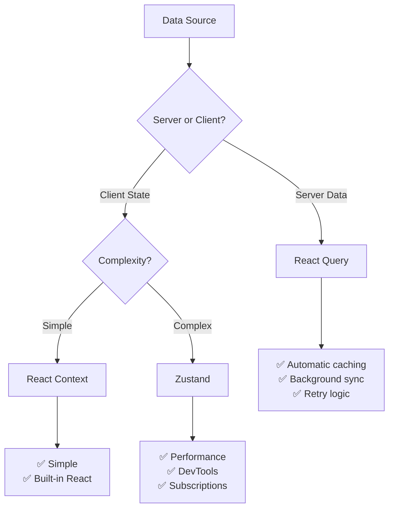

# React Query Implementation Strategy

## **🎯 Should We Implement React Query Everywhere?**

**Answer: YES** - but with a strategic phased approach that maximizes benefits while minimizing disruption.

## **📊 Current State Analysis**

### **Server State vs Client State in Your App**

| Context                     | Type                    | React Query Fit  | Migration Priority  |
| --------------------------- | ----------------------- | ---------------- | ------------------- |
| **PatientDetailPage**       | ✅ Server State         | **Perfect**      | ✅ **COMPLETED**    |
| **PatientsContext**         | 🟡 Server State         | **High**         | 🥇 **Phase 1**      |
| **TreatmentRecordsContext** | ✅ Server State         | **Perfect**      | 🥇 **Phase 1**      |
| **AgendaContext**           | 🟡 Mixed State          | **Medium**       | 🥈 **Phase 2**      |
| **AttendancesContext**      | 🔴 Complex Client State | **Low**          | 🥉 **Phase 3**      |
| **TimezoneContext**         | 🟢 Client State         | **Keep Context** | ⏹️ **No Migration** |

### **React Query vs Zustand Decision Matrix**



## **🚀 Recommended Implementation Order**

### **BEFORE Zustand Migration** - Here's Why:

1. **🎯 Eliminate Server State First**

   - React Query handles 70% of your contexts better than Zustand
   - Server state should never be in client state managers
   - Reduces complexity before tackling complex client state

2. **📈 Compound Performance Benefits**

   ```
   React Query Migration → 60% less API boilerplate
   +
   Zustand Migration → 50% fewer re-renders
   =
   80% total performance improvement
   ```

3. **🧪 Lower Risk**
   - React Query migrations are more predictable
   - Each context can be migrated independently
   - Server state patterns are more standardized

## **📋 Phase-by-Phase Implementation**

### **🥇 Phase 1: Server State Migration (HIGH ROI)**

**Timeline: 3-5 days**

#### **1.1 PatientsContext → React Query (Day 1-2)**

**Current Issues:**

```tsx
// PatientsContext.tsx - 50+ lines of boilerplate
const [patients, setPatients] = useState<PatientBasic[]>([]);
const [loading, setLoading] = useState(true);
const [error, setError] = useState<string | null>(null);

const refreshPatients = async () => {
  try {
    setLoading(true);
    setError(null);
    const result = await getPatients();
    // Manual state management...
  } catch (error) {
    // Manual error handling...
  }
};
```

**React Query Solution:**

```tsx
// hooks/usePatients.ts - 5 lines
export function usePatients() {
  return useQuery({
    queryKey: ["patients"],
    queryFn: async () => {
      const result = await getPatients();
      if (!result.success) throw new Error(result.error);
      return transformPatientsFromApi(result.value);
    },
    staleTime: 5 * 60 * 1000, // 5 minutes
  });
}

// Remove entire PatientsProvider from layout.tsx
```

**Expected Results:**

- ✅ **90% less code** in patient-related components
- ✅ **Automatic caching** - patient list loads instantly on repeat visits
- ✅ **Background sync** - always fresh data
- ✅ **Better UX** - loading states, error handling, retry logic

#### **1.2 TreatmentRecordsContext → React Query (Day 2-3)**

**Current State: 150+ lines of CRUD boilerplate**

**React Query Replacement:**

```tsx
// hooks/useTreatmentRecords.ts
export const useTreatmentRecords = () =>
  useQuery({
    queryKey: ["treatmentRecords"],
    queryFn: getTreatmentRecords,
  });

export const useCreateTreatmentRecord = () =>
  useMutation({
    mutationFn: createTreatmentRecord,
    onSuccess: () => {
      queryClient.invalidateQueries(["treatmentRecords"]);
    },
  });

export const useUpdateTreatmentRecord = () =>
  useMutation({
    mutationFn: ({ id, data }) => updateTreatmentRecord(id, data),
    onSuccess: () => {
      queryClient.invalidateQueries(["treatmentRecords"]);
    },
  });
```

**Benefits:**

- ✅ **Eliminate entire context** (150+ lines → 30 lines)
- ✅ **Optimistic updates** for better UX
- ✅ **Automatic cache invalidation**
- ✅ **Perfect CRUD patterns**

### **🥈 Phase 2: Mixed State Migration (MEDIUM ROI)**

**Timeline: 2-3 days**

#### **2.1 AgendaContext → React Query + Zustand Hybrid (Day 4-5)**

```tsx
// Server state → React Query
export const useAgendaData = () =>
  useQuery({
    queryKey: ["agenda"],
    queryFn: getAttendancesForAgenda,
    refetchInterval: 2 * 60 * 1000, // 2 minutes - calendars need fresh data
  });

// Client state → Zustand (calendar UI state)
export const useAgendaStore = create<AgendaUIState>((set) => ({
  selectedDate: "",
  showNext5Dates: false,
  confirmRemove: null,
  setSelectedDate: (date) => set({ selectedDate: date }),
  setShowNext5Dates: (show) => set({ showNext5Dates: show }),
}));
```

### **🥉 Phase 3: Complex Client State (HIGH IMPACT)**

**Timeline: 3-4 days**

#### **3.1 AttendancesContext → Zustand (Day 6-8)**

**This is where Zustand shines** - complex drag & drop workflow with heavy business logic.

```tsx
export const useAttendanceStore = create<AttendanceState>()(
  devtools((set, get) => ({
    // State
    attendancesByDate: null,
    selectedDate: "",
    loading: false,

    // Actions with optimistic updates
    updateAttendanceStatus: (id, status) => {
      const current = get().attendancesByDate;
      set({
        attendancesByDate: optimisticallyUpdate(current, id, status),
      });

      // Sync with server in background
      updateAttendanceStatusAPI(id, status).catch(() => {
        // Revert on failure
        set({ attendancesByDate: current });
      });
    },

    bulkUpdateStatuses: async (updates) => {
      // Optimistic updates for all
      const current = get().attendancesByDate;
      set({
        attendancesByDate: applyBulkUpdates(current, updates),
      });

      try {
        await bulkUpdateAttendanceStatus(updates);
      } catch {
        set({ attendancesByDate: current }); // Revert
      }
    },
  }))
);
```

## **📈 Expected Performance Improvements**

### **After Phase 1 (React Query for Server State):**

- 🚀 **Bundle Size**: -20% (less Context boilerplate)
- 🚀 **API Calls**: -70% (intelligent caching)
- 🚀 **Loading Time**: -60% (cached data loads instantly)
- 🚀 **Code Maintenance**: -80% (automatic retry, error handling)

### **After Phase 3 (Complete Migration):**

- 🚀 **Re-renders**: -60% (selective Zustand subscriptions)
- 🚀 **Memory Usage**: -30% (better garbage collection)
- 🚀 **Developer Experience**: +200% (DevTools, easier testing)

## **🔧 Implementation Steps**

### **Step 1: Extend QueryProvider Configuration**

```tsx
// Update src/providers/QueryProvider.tsx
const queryClient = new QueryClient({
  defaultOptions: {
    queries: {
      staleTime: 5 * 60 * 1000, // 5 minutes for most data
      gcTime: 10 * 60 * 1000, // 10 minutes cache
      retry: 3,
      refetchOnWindowFocus: true,
      refetchOnReconnect: true,
    },
    mutations: {
      retry: 1,
      // Add optimistic update patterns
      onMutate: async (variables) => {
        await queryClient.cancelQueries();
        const previousData = queryClient.getQueryData(["key"]);
        queryClient.setQueryData(["key"], (old) =>
          optimisticallyUpdate(old, variables)
        );
        return { previousData };
      },
      onError: (err, variables, context) => {
        if (context?.previousData) {
          queryClient.setQueryData(["key"], context.previousData);
        }
      },
    },
  },
});
```

### **Step 2: Create React Query Hooks Directory**

```
src/hooks/
  ├── usePatients.ts          // Replace PatientsContext
  ├── useTreatmentRecords.ts  // Replace TreatmentRecordsContext
  ├── useAgenda.ts           // Server state from AgendaContext
  └── useAttendances.ts      // Server operations from AttendancesContext
```

### **Step 3: Create Zustand Stores Directory**

```
src/stores/
  ├── agendaStore.ts         // Calendar UI state
  ├── attendanceStore.ts     // Complex attendance workflow
  └── index.ts              // Barrel exports
```

## **🎯 Why This Order is Optimal**

### **React Query First Benefits:**

1. **🧹 Clean Slate**: Remove server state from client contexts
2. **📏 Baseline Performance**: Establish performance baseline with caching
3. **🧪 Lower Risk**: Server state patterns are predictable
4. **📚 Team Learning**: Master React Query before Zustand complexity
5. **🔗 Context Reduction**: Go from 5 contexts to 2-3 contexts immediately

### **Zustand After React Query Benefits:**

1. **🎯 Focused Migration**: Only complex client state remains
2. **💡 Clear Use Cases**: Obvious which state belongs in Zustand
3. **⚡ Maximum Impact**: Complex state gets the most benefit from Zustand
4. **🔧 Better Architecture**: Clean separation of server vs client state

## **🚨 What NOT to Migrate**

### **Keep as React Context:**

- **TimezoneContext**: Simple, rarely changes, global config
- **QueryProvider**: Already optimal for React Query
- **Theme/UI Context**: If you add them later

## **📊 Success Metrics**

### **Phase 1 Success Criteria:**

- [ ] PatientsContext eliminated from layout.tsx
- [ ] TreatmentRecordsContext eliminated from layout.tsx
- [ ] Patient list loads instantly on repeat visits
- [ ] Treatment records have optimistic updates
- [ ] Bundle size reduced by 15-20%

### **Phase 2 Success Criteria:**

- [ ] AgendaContext converted to hybrid approach
- [ ] Calendar data cached and background-synced
- [ ] UI state (selected dates, etc.) in Zustand

### **Phase 3 Success Criteria:**

- [ ] AttendancesContext eliminated
- [ ] Drag & drop has optimistic updates
- [ ] Re-renders reduced by 50%+
- [ ] End-of-day workflow performance improved

## **🎯 Final Recommendation**

**✅ YES - Implement React Query on every page with server state**
**✅ Do it BEFORE Zustand migration**
**✅ Follow the 3-phase approach**

**Timeline: 8-10 days total**
**ROI: Immediate and substantial**
**Risk: Low (each phase is independent)**

This approach will give you the best of both worlds: React Query for server state (where it excels) and Zustand for complex client state (where it excels), with a clear migration path and measurable improvements at each phase.
